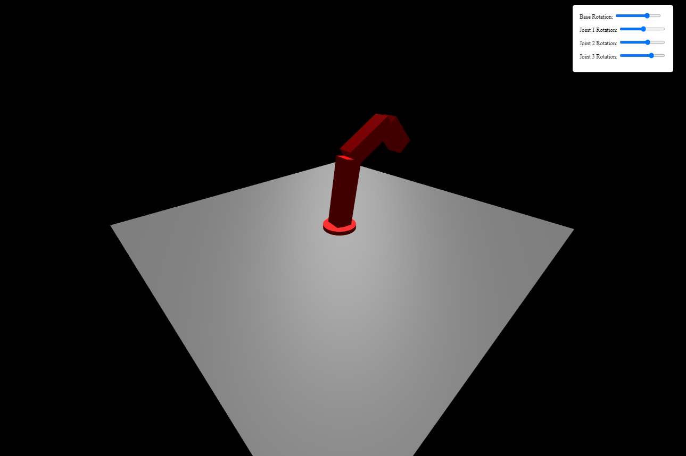
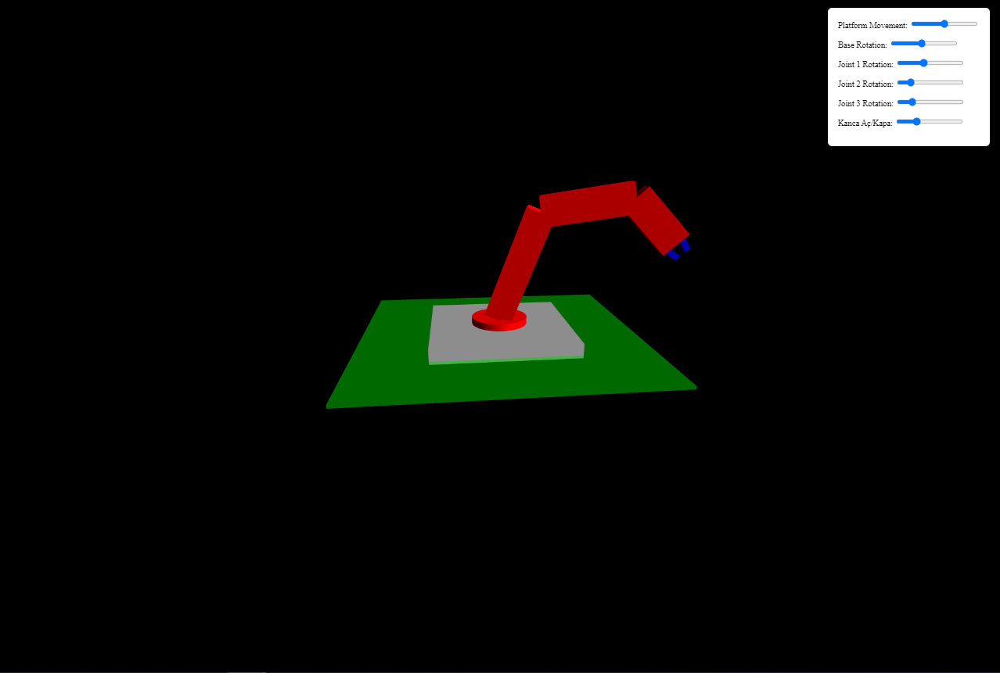

# Bilgisayar Grafikleri Dersi

Bu repository, üniversite öğrencileri için bilgisayar grafikleri dersi kapsamında Three.js kütüphanesini kullanarak grafiksel uygulamalar geliştirmeye yönelik bir kaynak sunmaktadır.

<div align="center">
    
    
</div>

## Proje Hakkında

Bu projede, Three.js kullanarak 3D grafikler oluşturma, sahne yönetimi, kamera kontrolü ve ışıklandırma gibi temel kavramları öğreneceksiniz. Proje, grafik programlama becerilerinizi geliştirmenizi amaçlamaktadır.
<div align="center">
    
</div>

## Kurulum

1. **Git ile Repo'yu Klonlayın**
   ```bash
   git clone https://github.com/SolidCNCSoftware/ComputerGraphics.git

## Ders İçeriği

### Giriş
- Bilgisayar grafiklerine giriş
- Three.js nedir?

### Temel Kavramlar
- Sahne, kamera ve renderer
- Geometriler ve materyaller

### Işıklandırma ve Gölgelendirme
- Farklı ışık türleri
- Gölgelendirme teknikleri

### Kamera Kontrolü
- Fare ve klavye ile kamera kontrolü
- OrbitControls kullanımı

### Animasyon ve Etkileşim
- Temel animasyonlar
- Kullanıcı etkileşimleri ekleme

### Proje Geliştirme
- Final proje önerileri
- Öğrencilerin projelerini geliştirmesi için kaynaklar

## Kaynaklar
- [Three.js Resmi Dokümantasyonu](https://threejs.org/docs/index.html#manual/en/introduction/Getting-started)
- [Three.js Örnekleri](https://threejs.org/examples/)
- [MDN Web Docs - WebGL](https://developer.mozilla.org/en-US/docs/Web/API/WebGL_API)

## Katkıda Bulunma
Katkılarınızı bekliyoruz! Eğer bu projeye katkıda bulunmak isterseniz, lütfen önce bir sorun bildirin veya önerinizi paylaşın.

## Lisans
Bu proje [MIT Lisansı](LICENSE) altında lisanslanmıştır.
